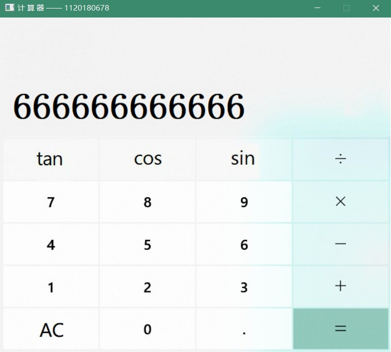

# 汇编计算器

汇编课程个人作业，要求实现一个带gui的计算器。

自己纯手写的所以可能比较简陋，里面加了自己的学号希望大家不要直接抄，看懂才是关键。>w<

界面是直接windows计算器截图...希望M$不要告我555

注意：里面用到的acllib是我基于官方版本修改过的。

学习资料：教材上没有找到x86的浮点单元介绍（可能是我不太仔细？），建议参考《现代X86汇编语言程序设计》一书。出于文件版权和大小的考虑，不能给大家提供完整的资料，我节选了浮点部分的pdf，一并附在目录下。如果可以的话，希望大家买一本纸书或者正版电子书支持一下原作者！至于其它部分，可以直接参考我们的教材~